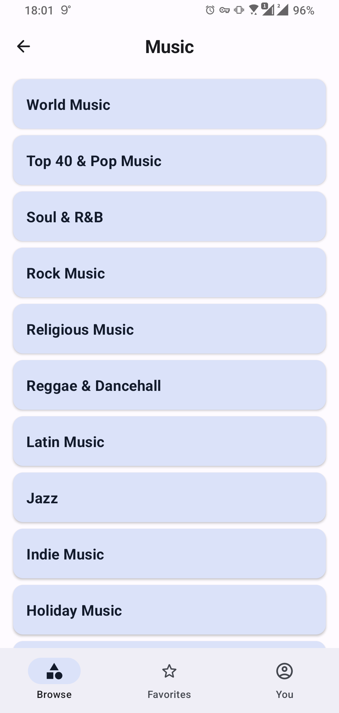
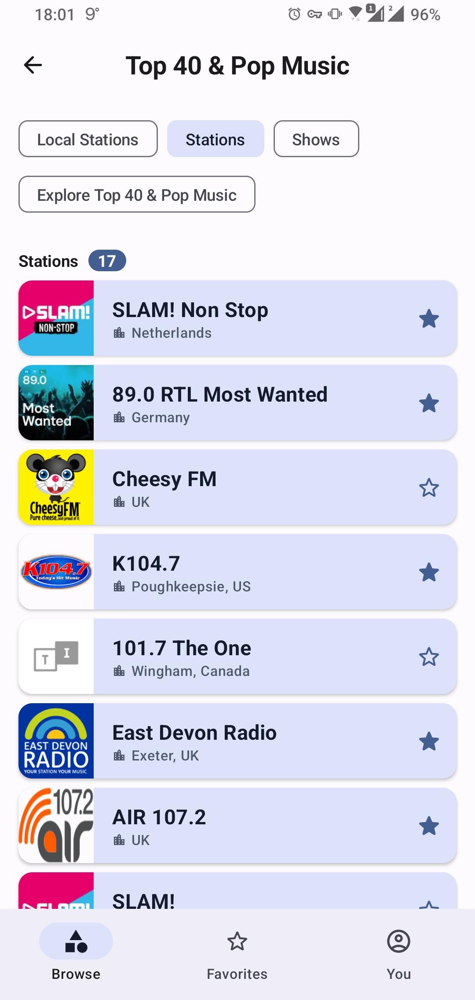
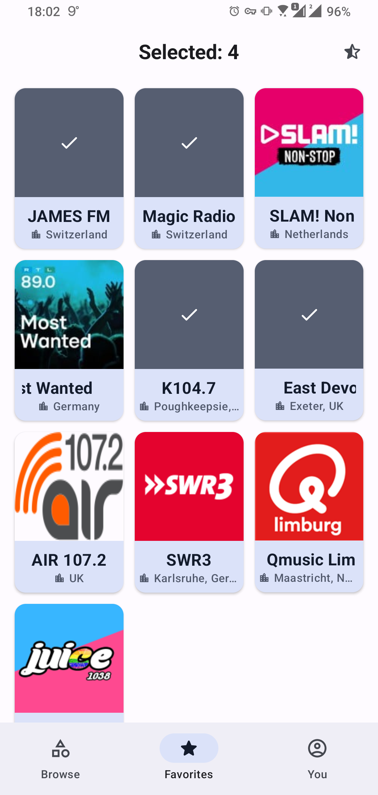
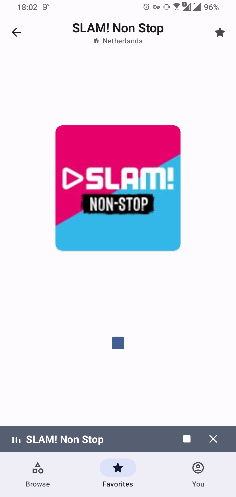
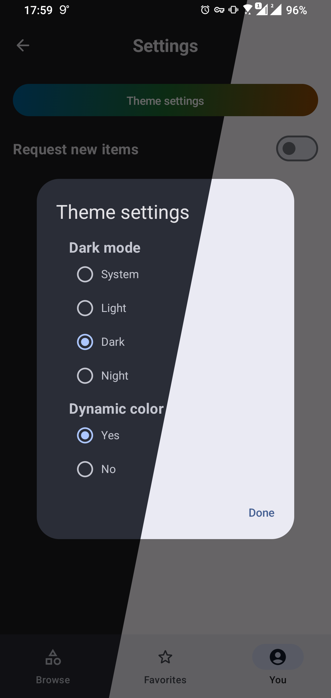

# Radio Stations

### Sandbox to test my skills and learn new ones

 

   
  
   
   
   

### About:

- Portrait, landscape, tablet support.
- Display list of categories or radio stations.
- Different item types.
- Offline mode.
- Favorites (locally).
- Play/control audio as a service.
- Profile picture from gallery or camera.
- Settings for the app.
- Dark/Light theme.
- Design guideline (Material3).
- Animations.
- Static and dynamic shortcuts.
- Performance, architecture, best practices.
- Tests... not 100% coverage.
- Firebase crashlytics, analytics, perfomance.

### Tech stack:

- Multi-module
- Clean Architecture
- Kotlin + KTS
- Coroutines + Flow
- Retrofit + Moshi
- Jetpack Compose + Navigation
- Hilt
- Room
- Coil
- Lottie
- ExoPlayer
- JUnit4 + MockK

### Bottlenecks:

- Server.
- Response type, the whole 'logic' and everything... not the best.
- The problem is that it requires some core workarounds, which impact the whole app.
- I left only one Entity type and made it all-on-one/dumb.
- The whole 'position' thing for saving in DB is wierd. There is a predefined sort from server but no response param for that.