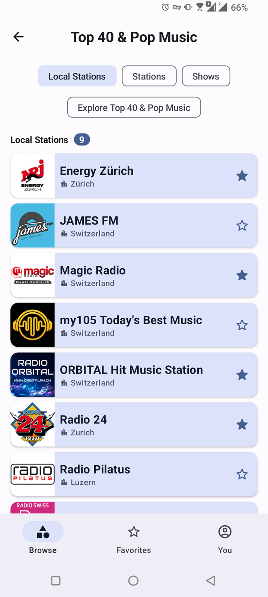

# Radio Stations

### Sandbox to test my skills and learn new ones

 

   
  
   
   
   

   
  
   
   
   

### About:

- Display list of categories or radio stations.
- Play/control audio as a service.
- Offline mode.
- Favorites (locally).
- Local user profile.
- Settings for the app.
- Static and dynamic shortcuts.
- [Material3](https://m3.material.io/) design system.
- Portrait, landscape, tablet support.
- Dark/Light theme.
- Firebase crashlytics, analytics, performance.
- Tests (Unit, Integration, UI).

### Tech stack:

Core:
- Multi-module + Gradle Convention Plugins
- [Clean Architecture](https://developer.android.com/topic/architecture)
- [Kotlin](https://kotlinlang.org/) + [DSL](https://developer.android.com/build/migrate-to-kotlin-dsl)
- [Coroutines](https://kotlinlang.org/docs/coroutines-overview.html) + [Flow](https://developer.android.com/kotlin/flow)
- [Jetpack Compose](https://developer.android.com/jetpack/compose) + [Navigation](https://developer.android.com/jetpack/compose/navigation)
- [Hilt](https://developer.android.com/training/dependency-injection/hilt-android)

Libs:
- [Room](https://developer.android.com/training/data-storage/room )
- [Datastore](https://developer.android.com/topic/libraries/architecture/datastore)
- [Retrofit](https://square.github.io/retrofit/) + [Moshi](https://github.com/square/moshi)
- [Paging3 (locally)](https://developer.android.com/topic/libraries/architecture/paging/v3-overview)
- [Coil](https://coil-kt.github.io/coil/compose/)
- [Lottie](https://github.com/airbnb/lottie-android)
- [Media3 ExoPlayer](https://developer.android.com/media/media3/exoplayer)
- [SmartToolFactory Picture Cropper](https://github.com/SmartToolFactory/Compose-Cropper)

Testing:
- [JUnit4](https://junit.org/junit4/), [MockK](https://mockk.io/), [Truth](https://truth.dev/)
- [Robolectric](https://robolectric.org/), [Turbine](https://github.com/cashapp/turbine)
- [Compose Testing](https://developer.android.com/jetpack/compose/testing)

### Providers:

- Inspiration: [Now In Android](https://github.com/android/nowinandroid)
- Radio Stations: https://opml.radiotime.com/
- Country list + phone codes: https://restcountries.com/
- Country flags: https://flagpedia.net/ or https://flagcdn.com/

### Bottlenecks:

- Server not the best. Requires some core workarounds, which impact the whole app.
- As an example:
  - single, all-on-one _CategoryEntity_ for categories and everything. Ideally should be separate.
  - _position_ field for saving in DB. There is a predefined sort from server but no query/response param for that.